# NEUCareer

Group members: Victor Wilm, Jacky Tung, Guoao Wei

## Iteration 1

### Tasks completed

Jacky:

- Completed authentication (sign in/sign up) with Firebase and maintained login persistency
- Created Firebase helper that stores user information into Firestore
- Built sign in and sign up pages
- Setup camera and photo library access that allows for customized profile picture

Victor:

- Created documents with fake data
- Integrated with firestore db to get logged in user Mentors
- Built My Mentors page with ListView and GridVew

Guoao:

- Built Home page, header and navigators
- Helped bug fixing and Android testing

Screenshots:

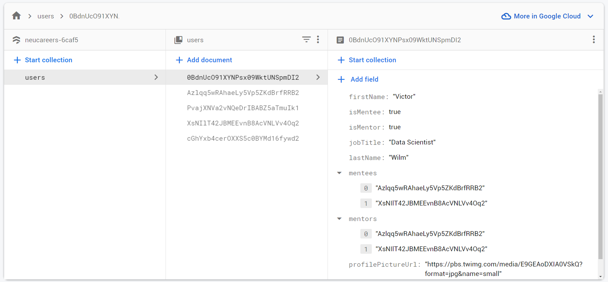
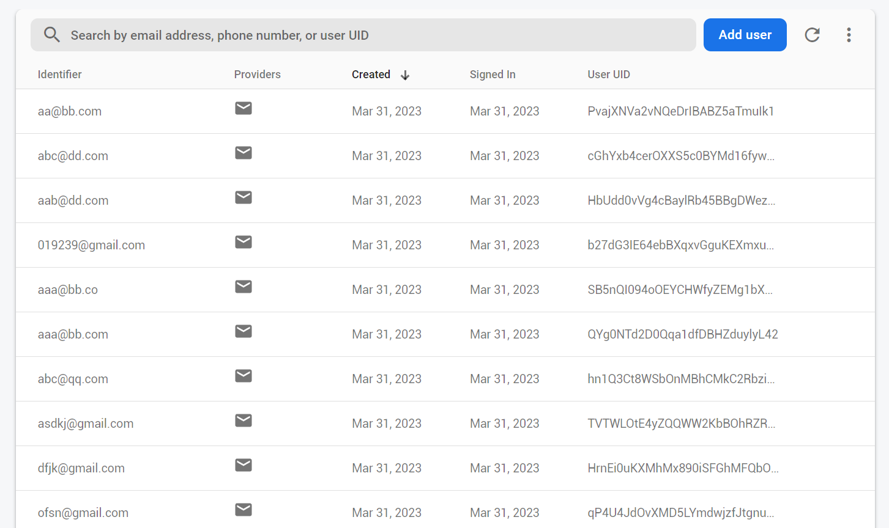

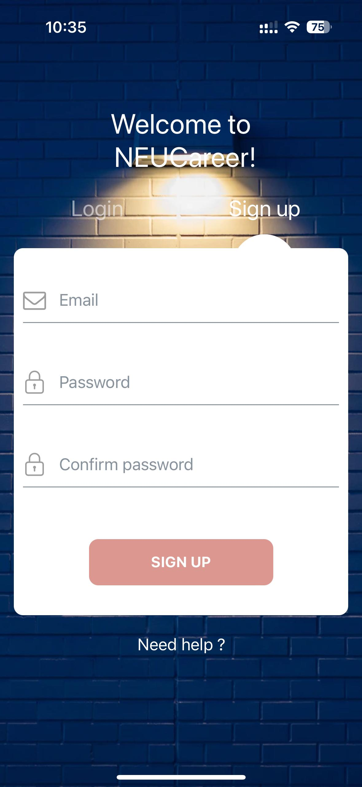
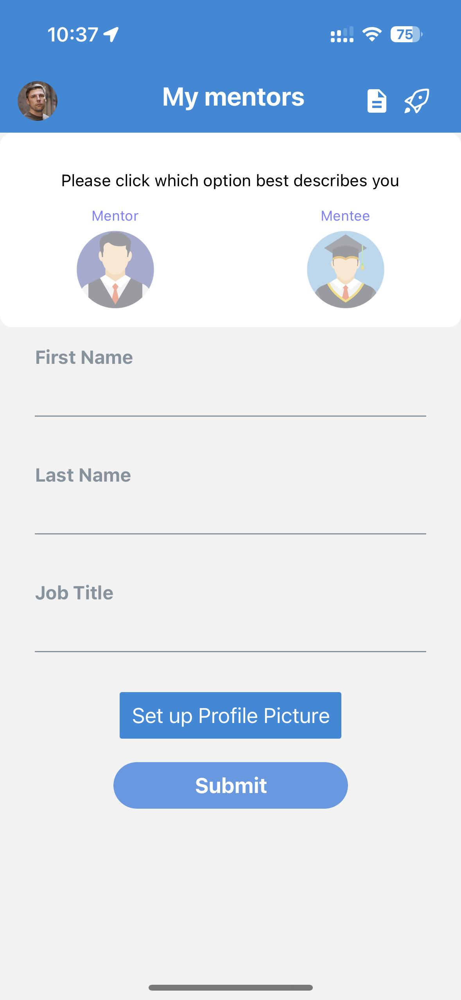
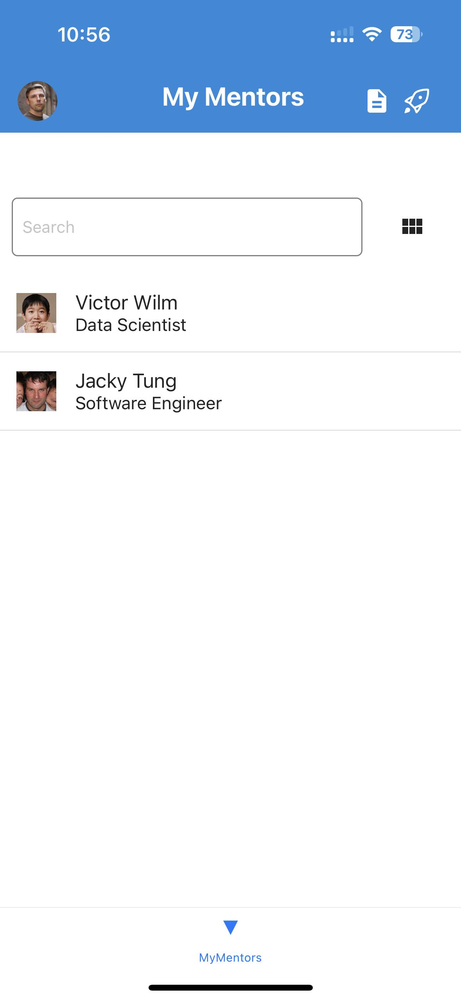
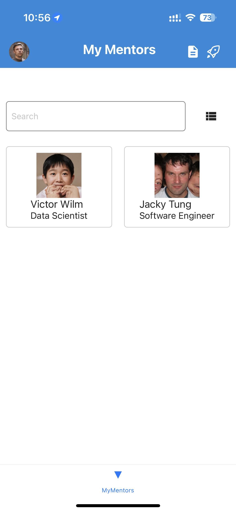

### Requirements

You should have React Native components created to represent the functionality you will be building, and the overall structure of your app should be in place.

- We have React Native components that are created for our sign-up/sign-in page. Our react component is also create for when the user inserts their information when they sign up.
- Our My Mentors list page is created. Creating the My Mentees page should be really quick since it is a duplicate of the same page.
- Calendar page and Profile page is not yet set up, but will be completed in the next iteration.
- Overall users can insert their information into the signup page, and we are able to push our information into firestorm.
- Book Meetings page needs to be done.
- Overall, we will need to also setup logout to end persistence.

* Navigation
  - Your app should have at least 2 navigators
    - Our app includes a bottom and top navigator once users signup/login
* The basis of CRUD operations to Firestore should be established and working.
  - The basis of CRUD operations work as we are able to set up our initial collection for users. Our other CRUD operations will work given that this works too.

### Next steps

Jacky:

- Setup permissions for photo and camera access
- Build user profile page
- Mentor profile page

Victor:

- Request to connect
- Accept connection

Guoao

- Book meeting page
- Obtain location and show static map

## Iteration 2

~~Authentication~~

Finished in iteration 1 and improved in iteration 2:

- Allow users to setup profile and background picture after signup.
- Allow users to provide more personal details for their profile page. Work and personal phone number, work and personal email, city, province/state, country,
  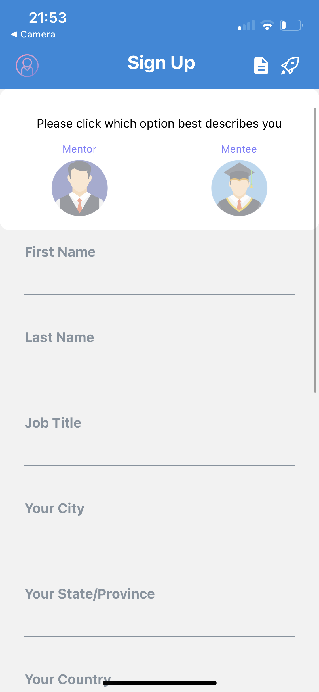
  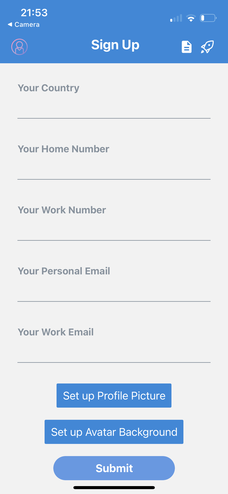
  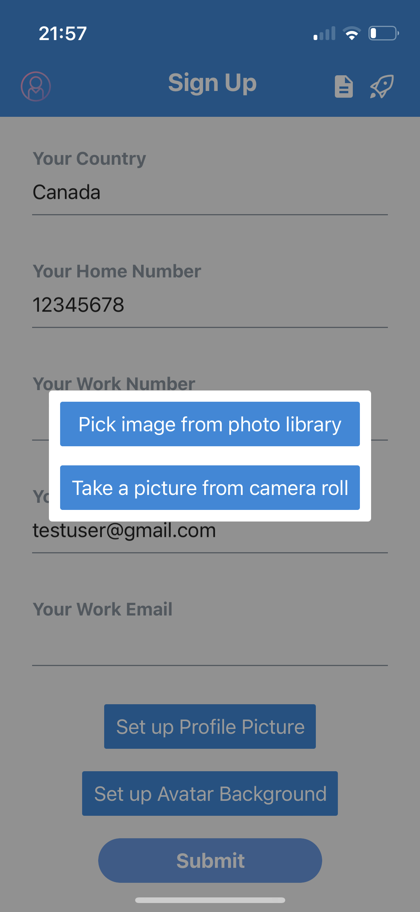
  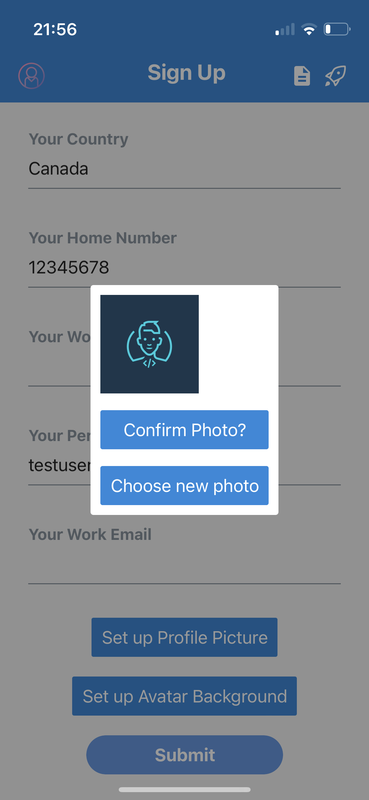
  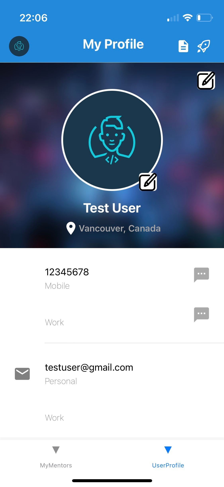

~~Camera use~~

Users can use the camera to take a picture for their avatar in user profile

~~Location use~~

The booking page obtains the current location, and autocomplete nearby location when user is typing in the input box.

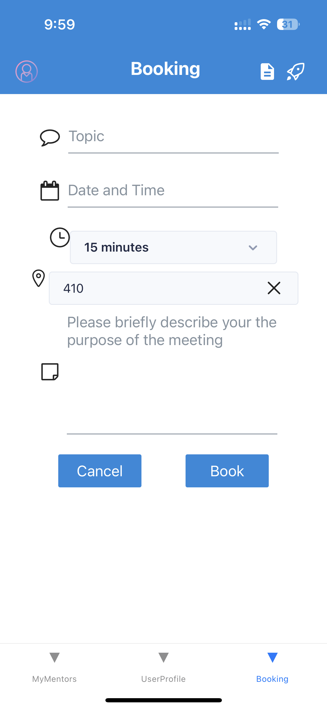
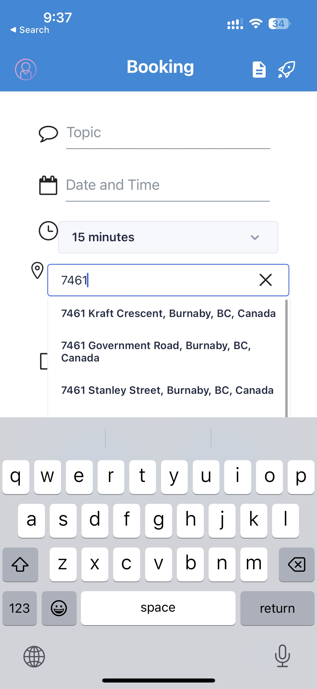

Notification

External API use

Guoao:

- Built a skeleton of the Booking page
- Added dropdown for selecting duration
- Added Autocomplete for address using Google API
- Fixed several bugs

Jacky:

- Header avatar now redirects to signupinfo page
- User profile and clicked profile now both has Headers. Profile Page is now the child component of User profile or Clicked Profile. Prop will be passed into Profile page to check this.
- Book meeting page UI completed for calendar, but does not get or update any data yet for real-time booking
  SignUp Info page is now both the signup page and the update profile page. This page's function changes depending on when the user is signed in or not.
- firestore now has helper that updates profile picture
- Profile page now has a button that can be used to update profile picture. This button will create an overlay for camera/libary options. This button is only available for User Profile and not Clicked Profile.
- Completed bug fixes. One of them includes that telephone numbers should be numbers not strings

Victor:

- Two new filters in my mentors page: New mentors and My mentors filters
- Filters allow users to hide any of the list
- Connect button: once clicked, a connection between the mentor and mentee is created, which will mentees to interact and meet with their mentors
- Disconnect button: ends the connection between a mentor and a mentee

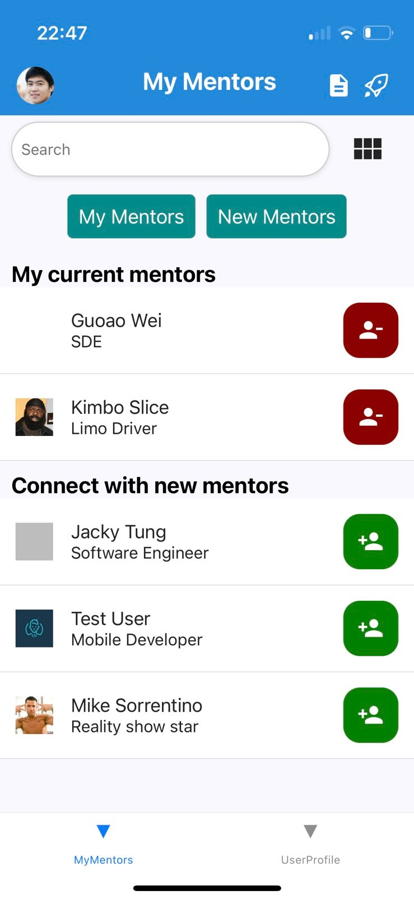
