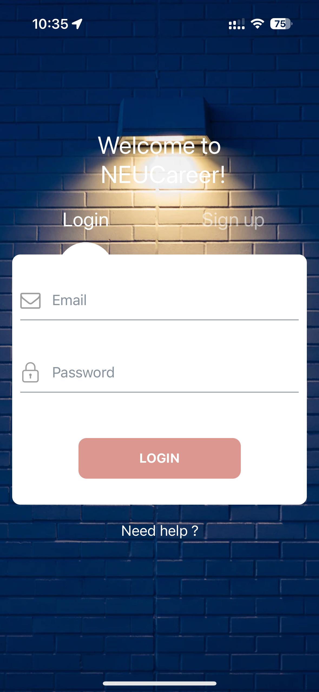

# NEUCareer

Group members: Victor Wilm, Jacky Tung, Guoao Wei

## Iteration 1

### Tasks completed

Jacky:

- Completed authentication (sign in/sign up) with Firebase and maintained login persistency
- Created Firebase helper that stores user information into Firestore
- Built sign in and sign up pages
- Setup camera and photo library access that allows for customized profile picture

Victor:

- Created documents with fake data
- Integrated with firestore db to get logged in user Mentors
- Built My Mentors page with ListView and GridVew

Guoao:

- Built Home page, header and navigators
- Helped bug fixing and Android testing

Screenshots:

### Requirements

You should have React Native components created to represent the functionality you will be building, and the overall structure of your app should be in place.
- We have React Native components that are created for our sign-up/sign-in page. Our react component is also create for when the user inserts their information when they sign up.
- Our My Mentors list page is created. Creating the My Mentees page should be really quick since it is a duplicate of the same page.
- Calendar page and Profile page is not yet set up, but will be completed in the next iteration.
- Overall users can insert their information into the signup page, and we are able to push our information into firestorm.
- Book Meetings page needs to be done.
- Overall, we will need to also setup logout to end persistence.

* Navigation
    * Your app should have at least 2 navigators 
        * Our app includes a bottom and top navigator once users signup/login
* The basis of CRUD operations to Firestore should be established and working.
    * The basis of CRUD operations work as we are able to set up our initial collection for users. Our other CRUD operations will work given that this works too.

### Next steps

Jacky:

- Setup permissions for photo and camera access
- Build user profile page
- Mentor profile page

Victor:

- Request to connect
- Accept connection

Guoao

- Book meeting page
- Obtain location and show static map